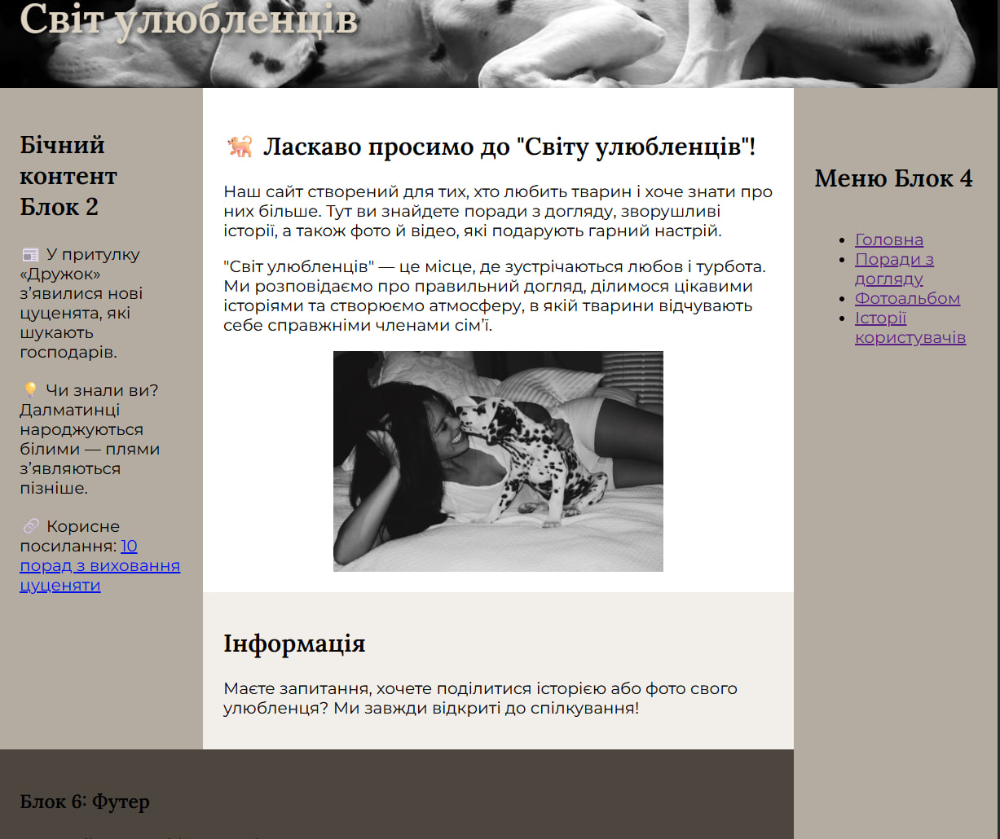

# Звіт до лабораторної роботи №1

**Дисципліна:** Web-програмування  
**Тема:** Розробка HTML-структур та візуалізація з допомогою CSS  

**Варіант:** 13  
**Виконала:** Мальцева Софія, група ІП-41  

---

## Мета роботи
- Ознайомитися з основними можливостями мови розмітки гіпертексту HTML.  
- Навчитися застосовувати базові стилі CSS для візуалізації веб-сторінок.  
- Сформувати початкові практичні навички зі створення структури сайту та його оформлення.  
- Освоїти принципи організації навігації між кількома сторінками.  

---

## Умови лабораторної роботи
1. Обрати варіант виконання завдання згідно з номером у списку групи.  
2. Засобами HTML створити веб-сторінку заданого вигляду з використанням CSS.  
3. Замінити у шаблоні умовні позначки «X» та «Y» власними назвами та гаслами.  
4. Один із блоків використати для навігаційного меню, інші — для текстового наповнення.  
5. Створити п’ять копій сторінки та реалізувати навігацію між ними.  
6. Використати теги **UL, OL, LI, IMG, A, MAP** для організації списків, вставки зображень та створення гіперпосилань.  
7. Перевірити коректність відображення сайту на різних розмірах вікна браузера (адаптивність).  
8. Продемонструвати роботу сайту локально.  
9. Опублікувати сайт за допомогою GitHub Pages.  
10. Порівняти особливості доступу до сайту локально та через інтернет.  
11. Продемонструвати роботу сайту онлайн.  

---

## Хід виконання
У ході роботи було виконано такі кроки:  

1. Створено базову структуру HTML-документа з основними блоками (`header`, `aside`, `main`, `footer`).  
2. Розроблено навігаційне меню на основі тегів `ul` та `li`, яке дозволяє переходити між п’ятьма сторінками.  
3. Додано кілька текстових блоків для демонстрації заповнення сайту інформацією.  
4. Використано зображення як через тег ``, так і як фон для окремих блоків.  
5. Створено приклади нумерованих та маркованих списків (`ol`, `ul`).  
6. Для одного зображення реалізовано інтерактивну карту (`map`) з клікабельними областями.  
7. За допомогою CSS реалізовано кольорову схему сайту, стилізовано заголовки та текст, додано адаптивність для мобільних пристроїв.  
8. Сайт протестовано локально та опубліковано через **GitHub Pages**.  

---

## Результат роботи

На рисунку наведено приклад вигляду головної сторінки сайту:  

---

## Посилання на опублікований сайт

🔗 [Переглянути сайт](https://weruu.github.io/labaVeb1/)

---

## Висновок

У ході виконання лабораторної роботи було:
1.створено структуру веб-сторінки з використанням HTML;
2.застосовано стилізацію за допомогою CSS;
3.організовано багатосторінкову навігацію;
4.додано зображення, списки, посилання та інтерактивну карту;
5.перевірено адаптивність сайту;
6.опубліковано сайт на GitHub Pages та протестовано його роботу онлайн.
Таким чином, було здобуто базові практичні навички веб-розробки та роботи з хостингом через GitHub.

У ході виконання роботи було створено веб-сторінку за допомогою HTML і
CSS, реалізовано навігаційне меню, додано зображення та опубліковано
сайт на GitHub Pages. Веб-сторінка коректно відображається у браузері
при різних розмірах вікна.
